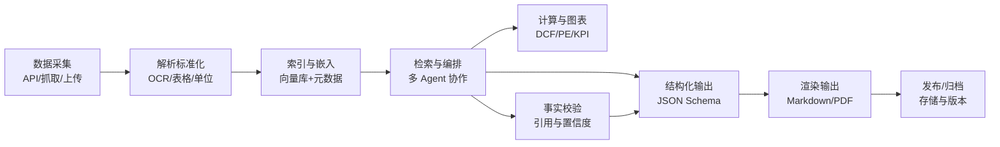

## LLM 报告生成工作流大纲（面向 fin/template.txt 模板）

### 1. 目标与范围
- **目标**: 自动生成符合 `fin/template.txt` 结构的“一页公司卡”报告，含结构化计算与带引用的文本生成。
- **范围**: 覆盖数据采集、解析标准化、知识库构建（RAG）、报告编排/计算、事实校验与引用、渲染输出、可观测与合规。

### 2. 数据源与采集
- **权威/付费**: Bloomberg、Capital IQ、Factset、Morningstar Direct、LSEG Workspace、EMIS、S&P NetAdvantage、Value Line（参考 `fin/info_source.txt`）。
- **免费/开放**: Alpha Vantage、SEC EDGAR、Yahoo Finance（含 yfinance）、NewsAPI、GDELT、公司官网/财报 PDF、投资者关系网页。
- **自有/离线**: PDF、DOCX、XLSX、TXT、网页快照。
- **接入方式**:
  - API 拉取（REST/Websocket）：行情、财务、新闻。
  - 文档抓取：爬虫+速率控制+Robots 合规；或人工上传。
  - 变更检测：Ticker 订阅、RSS、EDGAR 8-K/10-K/10-Q 增量追踪。

### 3. 文档解析与标准化
- **解析**: PDF/HTML/DOCX 结构解析、OCR（扫描件）、表格提取（财报表格）、货币/单位标准化、日期归一、语言检测与翻译（可选）。
- **工具**: Unstructured、Apache Tika、pdfplumber、Camelot/Tabula、Tesseract OCR、trafilatura/Readability（网页正文抽取）。
- **标准化**: 统一字段键（ticker、period、fiscal_year_end、source_url、page_anchor、currency、unit）。

### 4. 知识库构建（RAG）
- **切分**: 基于语义/结构（标题、表格、段落、脚注）分块；保留来源锚点（页码/段落号）。
- **嵌入模型**: OpenAI text-embedding-3-large/small、bge-m3、e5-mistral；向量维度与成本权衡。
- **向量库**: FAISS、Chroma、Milvus、Weaviate、Postgres+pgvector。
- **元数据**: {ticker, report_type, period, page, section, currency, updated_at, source_url}。
- **更新策略**: 全量初建 + 增量摄取（基于哈希/ETag/发布时间）。

### 5. 工作流编排与角色分工
- **框架**: LangChain / LlamaIndex / DSPy（任选其一为主，便于管道化与评测）。
- **子任务代理**:
  - A 概览撰写 Agent（简洁业务、关键驱动、变化）
  - B 商业模式 Agent（Who pays/For what/频率、GTM、护城河）
  - C 基础指标 Agent（口径对齐/口算校验）
  - D 情绪/新闻 Agent（新闻抓取+主题聚类+情绪）
  - E 质量快照 Agent（会计质量/治理红旗）
  - F KPI 小图 Agent（生成/嵌入）
  - G 估值 Agent（DCF/可比/SoTP）
  - H 风险 Agent（Top3 风险与监控）
  - I 引用与信心 Agent（引用去重与打分）
- **工具调用**: 计算器（财务公式）、检索器（RAG）、数据 API、图表渲染器、校验器。

### 6. 生成与约束（对齐 fin/template.txt）
- **流程**: 检索证据 → 生成草稿 → 反思/自检（约束/一致性）→ 事实核对 → 结构化成 JSON → 模板渲染 Markdown。
- **结构化 Schema**: 对应 `template.txt` A–I 每一段落的字段与字数限制（例如 B ≤ 80 字 + 图示）。
- **模板映射**:
  - Header: ticker、exchange、sector、geography、fiscal_year_end、last_update。
  - A: 业务简述、核心价值驱动、环比/同比变化。
  - B: Who pays/For what/How often、GTM、护城河描述与图示。
  - C: Revenue/GM/FCF 拆解、关键分部节点、P/E 与 EPS。
  - D: CAC、GP12、Payback、LTV、敏感性盒子（±）。
  - E: 护城河勾选 + 证据，周期性/经营杠杆，会计质量，治理红旗。
  - F: 8 季度 KPI 迷你图（Revenue/GM/FCF margin/ROIC）。
  - G: 估值方法、区间、敏感性、同业校验。
  - H: Top3 风险与监控指标。
  - I: 来源链接（带页/段锚点）、置信度、覆盖说明。

### 7. 财务计算与可视化
- **核心公式**: Revenue 拆分、GM、FCF、P/E、EPS、LTV、Payback、敏感性分析、DCF（WACC、LT growth、margin target）。
- **实现**: Python pandas/numpy + 自定义校验器（口径一致性、单位/币种转换、区间检查）。
- **图表**: matplotlib/plotly 生成迷你图；或 QuickChart 静态图；嵌入 Markdown/导出 PNG。

### 8. 事实校验、引用与防幻觉
- **引用策略**: 每个结论绑定证据块 ID + source_url + page_anchor；生成时强制引用。
- **自动校验**: RAGAS/DeepEval 指标（忠实度、引用完整率、答案正确度）；数值回算一致性检查。
- **规则护栏**: 结构化提示、工具优先（先算后写）、阈值触发人工复核。

### 9. 合规与可观测
- **日志与追溯**: 输入/检索命中/中间 JSON/最终稿版本化；OpenTelemetry 跟踪。
- **秘钥管理**: .env + 云端 Secret（AWS Secrets Manager / HashiCorp Vault）。
- **合规模块**: Robots/版权、数据许可、PII 保护、审计留痕。

### 10. 输出与分发
- **渲染**: Markdown → PDF（Pandoc/md-to-pdf/WeasyPrint）；可选 PPT（python-pptx）。
- **发布**: 文件系统/对象存储；Notion/Confluence/Google Docs API；邮件/IM 推送。
- **调度**: 手动触发、CRON、Airflow/Prefect/Dagster。

### 11. 监控与评测指标
- **质量**: 忠实度、引用率、覆盖率、计算一致性、可读性。
- **运营**: 延迟、成本、吞吐、命中率、失败率。
- **业务**: 采纳率、复用率、更新时间线。

### 12. 工具与 API 清单（候选）
- **LLM**: OpenAI（GPT-4o/4.1/mini 等）、Azure OpenAI、Anthropic Claude 3.5、Google Gemini、局部部署 vLLM（Llama/Qwen/Mistral）。
- **嵌入**: OpenAI text-embedding-3-large/small、bge-m3、e5-mistral。
- **向量库**: FAISS、Chroma、Milvus、Weaviate、Postgres+pgvector。
- **解析**: Unstructured、Apache Tika、pdfplumber、Camelot/Tabula、Tesseract。
- **数据源**: Alpha Vantage、SEC EDGAR、Yahoo Finance/yfinance、NewsAPI、GDELT；（付费）Bloomberg、Capital IQ、Factset、Morningstar、LSEG、EMIS、S&P NetAdvantage、Value Line。
- **可视化/导出**: matplotlib/plotly、QuickChart、Pandoc、md-to-pdf、WeasyPrint、python-pptx。
- **编排/评测**: LangChain、LlamaIndex、DSPy、Ragas/DeepEval、Guardrails。
- **调度/运维**: Airflow/Prefect/Dagster、Docker、OpenTelemetry、Sentry、ELK/Loki。
- **秘钥/配置**: python-dotenv、AWS Secrets Manager、HashiCorp Vault。

### 13. MVP 最小可行方案（建议起步）
- yfinance + SEC EDGAR 抓取（公开数据）
- Unstructured 文档解析 + 标准化
- OpenAI text-embedding-3-small + Chroma 索引
- LangChain 编排 + GPT-4o-mini 生成（结构化 JSON + 模板渲染）
- Pandoc 导出 PDF；QuickChart 生成 KPI 迷你图

### 14. 迭代路线
- 引入付费数据源与权限控制；估值模块可解释性增强；RAG 细粒度引用；批量生成与回测；人审环节与批注工作台；多公司对比与历史版本回溯。

